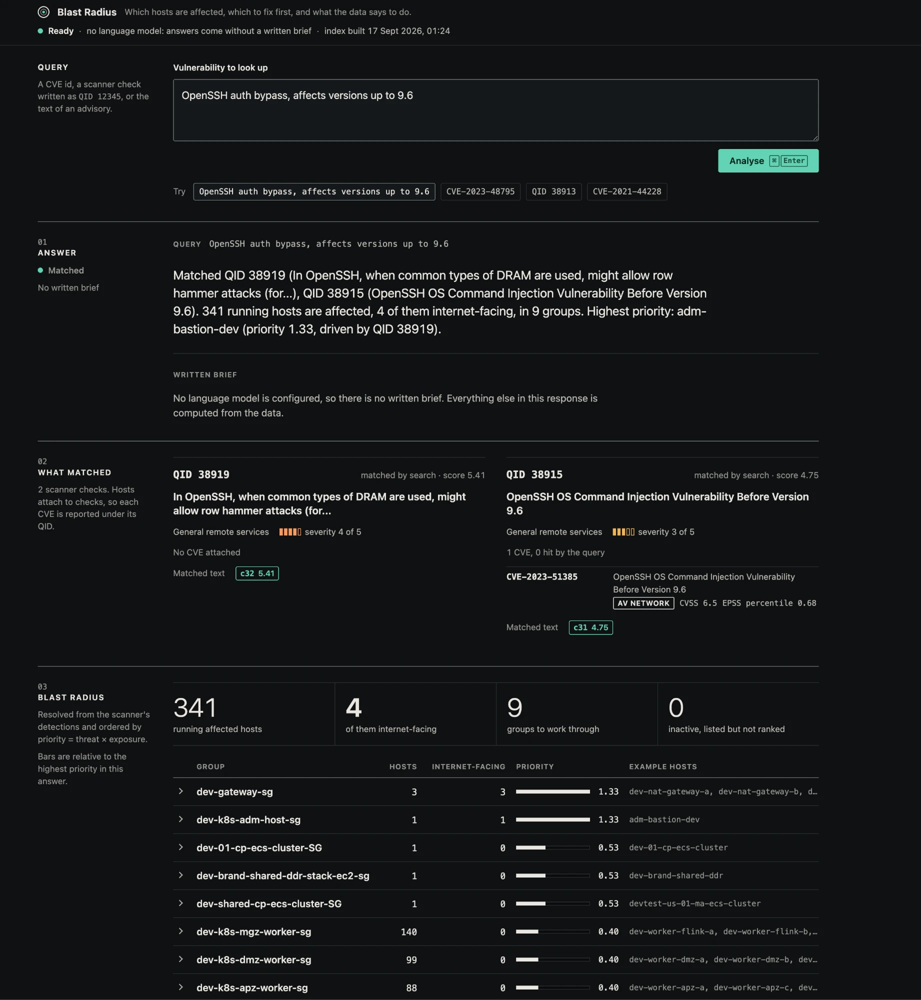
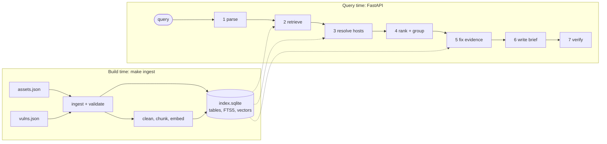

# Blast Radius

**Blast Radius takes a newly reported vulnerability (a CVE ID, a scanner QID or
the text of an advisory) and tells you which hosts in your environment are
affected, which to fix first and what to do, with every statement quoted from
the source data and every quote checked before it is shown.**

It is built for vulnerability-management analysts and security engineers, and
it works from what a scanner already exports: the asset inventory and the list
of findings. Today it reads Qualys exports in the shape of the
[reference dataset](#the-reference-dataset).



*The single-page UI on the reference dataset, running without a language model:
the two scanner checks the query matched, then 341 affected hosts folded into 9
groups and ordered by priority.*

```bash
make install   # create .venv with every dependency and the dev tools
make data      # check that the scanner exports are in place and intact
make ingest    # build the index artifact; fetches two small models once
make serve     # API and UI on http://localhost:8000
make eval      # print the retrieval comparison table
```

Search and host resolution need no API key, and no network once the models are
cached. Set `OPENAI_API_KEY`, in the environment or in `.env`, to get the
written brief as well (or `ANTHROPIC_API_KEY` with
`BLAST_LLM_PROVIDER=anthropic`). Without it
the service returns everything except the prose.

## Getting the data

The scanner exports are not in the repository: one is 367 MB and both describe
a real environment. Put `asset_data_scrubbed.json` and
`vulns_data_scrubbed.json` in `data/`, or keep them elsewhere and pass
`DATA_DIR=/path/to/exports` to `make`. `make data` checks both files against
`data.sha256`, and `make ingest` runs that check first. The tests do not need
the exports; they run on a small synthetic fixture.

## What you get

An example using real values from the reference dataset:

```
Query    OpenSSH auth bypass, affects versions up to 9.6

Match    QID 38919, OpenSSH row hammer auth bypass, severity 4, no CVE  [1]
         QID 38915, OpenSSH command injection before 9.6, CVE-2023-51385 [2]
Hosts    341 affected, all running, all with port 22 open
First    adm-bastion-dev, dev-nat-gateway-a, -b and -c
         internet-facing, criticality 5
Then     327 Kubernetes workers in three security groups (140, 99, 88)
         10 other internal hosts
Do       Upgrade OpenSSH to a version later than 9.6.
         "Affected Versions: OpenSSH up to version 9.6"                  [1]
         "Affected Versions: OpenSSH before version 9.6"                 [2]
Fix      One patch reference and two advisories for CVE-2023-51385;
         the data holds no patch reference for QID 38919.
```

The host table, the ordering and every number are computed from the data. The
language model writes only the prose around them.

## Contents

*   [Getting the data](#getting-the-data)
*   [The problem](#the-problem)
*   [How you use it](#how-you-use-it)
*   [The reference dataset](#the-reference-dataset)
*   [Design principles](#design-principles)
*   [Architecture](#architecture)
*   [API and UI](#api-and-ui)
*   [Evaluation](#evaluation)
*   [Design decisions and tradeoffs](#design-decisions-and-tradeoffs)
*   [Alternatives considered](#alternatives-considered)
*   [What it cannot tell you](#what-it-cannot-tell-you)
*   [Roadmap](#roadmap)
*   [Repository layout](#repository-layout)
*   [Configuration](#configuration)
*   [Development](#development)
*   [Deployment and operations](#deployment-and-operations)

## The problem

When an advisory lands, the first hour goes to three questions: are we
affected, where, and what do we do about it? The answers sit in two scanner
exports that do not explain each other. The obvious shortcut, putting
everything in a vector store and asking a language model, fails in predictable
ways. Each row below is a failure this design is built to prevent.

| A naive RAG assistant                                         | Blast Radius                                                            |
|---------------------------------------------------------------|-------------------------------------------------------------------------|
| Returns the top-k similar rows, so 341 affected hosts become 5 | Resolves hosts with a SQL join over the scanner's own detections        |
| Lets the model count and rank                                 | Counts and ranks in code; the model only writes the prose               |
| Answers "how do I fix it" from memory                         | Quotes the retrieved text, checks every quote, says when no fix exists  |
| Confuses hundreds of near-identical kernel CVEs               | Hybrid search plus a cross-encoder reranker, measured by `make eval`    |
| Returns its nearest neighbour when nothing matches            | Abstains below a score floor and reports what the data does not cover   |
| Follows instructions hidden in third-party advisory text      | Treats the corpus as untrusted; the model cannot change hosts or order  |
| Stops working when the model API is down                      | Degrades to a no-LLM response with hosts, ranking and fix evidence      |

## How you use it

There are three ways in.

1.  **A new advisory arrives.** You paste free text. The service extracts the
    product and version, searches the vulnerability write-ups, and returns a
    brief like the one above.
2.  **A known identifier.** You enter `CVE-2023-48795` or `QID 38913`. The
    identifier is looked up directly and no search runs. This path works with
    no language model at all.
3.  **Not in the environment.** You enter `CVE-2021-44228` (Log4Shell), which
    is absent from the reference dataset. The service answers that there is no
    detection and no write-up, and adds that this is not evidence of absence,
    because 149 of the 197 QIDs detected in that environment have no write-up.

The service is advisory and read-only. It does not apply fixes, reason about
software versions, ingest live scanner data or answer general security
questions.

Blast radius comes first because it is the first question after every advisory,
and because the scanner's detections give it an exact ground truth, so the
system can be measured rather than judged. The [roadmap](#roadmap) lists the
workflows that build on the same index.

## The reference dataset

All examples and evaluation numbers in this README come from one reference
dataset: two Qualys exports for a single AWS development environment, with
identifying details scrubbed. [Getting the data](#getting-the-data) says where
to put them.

|             | `asset_data_scrubbed.json`                 | `vulns_data_scrubbed.json`                   |
|-------------|--------------------------------------------|----------------------------------------------|
| Size        | 16 MB                                      | 367 MB                                       |
| Records     | 1,273 hosts                                | 6,005 rows                                   |
| A record is | one EC2 host: tags, open ports, detections | one detection paired with one CVE, explained |

**How they join.** A host's detection list holds only references: `qid`,
`hostInstanceVulnId` and two dates. The vulns file explains a subset of those
references. `vulns.asset.id` equals `assets.id`, and `vulns.hostInstanceVulnId`
matches an entry under the same host. All 6,005 rows match. Each vulns row also
embeds a full copy of its host record, identical to the asset file; those
copies account for 220 of the 367 MB. A detection whose QID maps to several
CVEs appears once per CVE, which is how 1,832 detections become 6,005 rows.

**Hosts.** 1,272 Linux and one Windows; 1,201 running. 14 are tagged
internet-facing, and the same 14 are the only hosts with a public IP and the
only hosts with criticality 5. 929 hosts have no detections. The other 344 hold
64,390 detections across 197 QIDs, a median of 184 per host.

**Coverage.** The vulns file explains 48 of the 197 QIDs, and for those 48 it
is complete. The other 149 QIDs, 97% of detections, are bare numbers with no
description anywhere in the data. Most appear on almost every scanned host, and
several are recognisable as scanner informational checks, but the data does not
say so.

**The text corpus** is therefore small: 512 CVE descriptions and 48 QID
diagnoses.

*   434 of the 512 descriptions open with the same sentence, "In the Linux
    kernel, the following vulnerability has been resolved". One QID bundles 219
    of them.
*   Descriptions have a median of 655 characters, but 83 exceed 2,400, and 68
    of those contain kernel call traces or register dumps.

**Gaps.** `how_to_fix` is "N/A" on all but 9 rows. CVSS is present for 235 of
the 512 CVEs. The news, social and exploit proof-of-concept fields are empty,
and one CVE is marked as known-exploited. Two QIDs have no CVE attached, and
one of them, QID 38919 (OpenSSH), is the most widespread explained finding, on
341 hosts.

**Fix evidence that does exist.** 160 CVEs have a reference tagged "Patch" and
43 have one tagged as an advisory. 24 of the 48 diagnoses have an "Affected
Versions" section. All 20 Ubuntu QIDs name the package whose security update
fixes them.

**What that implies.**

1.  **Blast radius is a join, not a search.** "Which hosts are affected" has an
    exact answer in the detections. A top-k similarity search cannot return 341
    hosts, and a language model should not be asked to count them. Retrieval
    has a narrower job: map your words to the right QIDs and CVEs.
2.  **The corpus is small but hard.** Hundreds of near-identical kernel
    descriptions sit beside exact tokens such as `CVE-2024-36971`, `traefik`
    and `mod_proxy`. Embeddings blur the first; keyword search misses
    paraphrases of the second. That is the case for hybrid search and a
    reranker, and it can be measured.
3.  **Fix guidance is mostly missing.** A model asked "how do I fix this" will
    answer from memory unless it is held to the retrieved text. The brief must
    quote what the data says and state plainly what it does not say.

## Design principles

1.  **Structured questions get structured answers.** Hosts, counts and ranking
    come from SQL and arithmetic.
2.  **The language model is outside the authority path.** It reads and writes
    text. It cannot add, drop or reorder hosts.
3.  **Nothing unverified is presented as fact.** Quotes are checked against
    their sources, and gaps in the data are reported as gaps.
4.  **Degrade, do not fail.** If the language model is unavailable, the service
    still returns the matches, the hosts, the ranking and the fix evidence.

## Architecture

At build time, `ingest` turns the two exports into an index artifact: a single
SQLite file that holds the tables, the keyword index and the embedding vectors.
At query time, a stateless FastAPI service opens the artifact read-only and
runs a fixed seven-step pipeline.



### Data model

One SQLite file. Column lists are abbreviated.

```sql
hosts(id PK, name, os, criticality, state, internet_facing, public_ip,
      private_ip, region, vpc_id, security_group, cluster, role,
      is_docker_host, last_scan)
open_ports(host_id, port, protocol, service)
detections(id PK, host_id, qid, first_found, last_found)  -- 64,390 rows
qids(qid PK, category, severity, pci_flag, diagnosis, explained)  -- 197
cves(cve_id PK, title, description, cvss, epss, epss_percentile,
     attack_vector, known_exploited, kev_required_action,
     cogent_risk_score, published, cwes, patch_refs)          -- 512
qid_cves(qid, cve_id)                                         -- 513
chunks(id PK, doc_type, doc_id, kind, title, text)           -- 1,005
chunks_fts(title, body)  -- FTS5 index over every chunk
embeddings(chunk_id PK, vector)  -- 766 BLOBs, text chunks only
meta(key, value)  -- input hashes, embedding model, chunk settings, build time
```

`qids.explained` is false for the 149 QIDs that have no write-up, so the
service can count what it cannot explain.

### Build time

*   **Load.** Both files are read with `json.load`. For the vulns file this
    measured 2 seconds and a 1.6 GB peak. That cost is paid at build time only;
    the serving process never opens the raw JSON.
*   **Validate, then drop.** Ingest asserts that every vulns row matches a
    detection under the same host with the same QID and dates, and that each
    embedded host copy equals the asset file's record. It then discards the
    copies. A violated assertion fails the build and names the offending row.
*   **Atomic output.** The artifact is written to a temporary path and moved
    into place with `os.replace`, so a failed ingest never leaves a half-built
    index. `meta` records the SHA-256 of each input file.
*   **Clean.** HTML tags and entities are stripped from diagnoses. The shared
    opening sentence is removed from the 434 kernel descriptions, because
    identical text pulls their embeddings together.
*   **Chunk.** Text is split on paragraph and then sentence boundaries into
    chunks of at most about 1,200 characters, with one sentence of overlap. The
    embedding model truncates input at 512 tokens, roughly 2,000 characters, so
    unchunked embedding would silently ignore the tails of the longest
    descriptions. About 70% of documents are shorter than one chunk.
*   **Separate the traces.** Chunks that are mostly call trace or register dump
    are marked `kind = trace`. They stay in the keyword index, where a function
    name such as `nfs_net_init` is a useful exact term, but they are not
    embedded and are not shown to the language model.
*   **Context header.** Each chunk is indexed with its document title.
    Identifiers are not indexed as text at all, because they are resolved by
    primary key, so a QID that bundles 219 CVE IDs does not flood the keyword
    index or the embedding.
*   **Embed.** Text chunks are embedded once at build time and the vectors are
    stored in the same SQLite file, so the artifact is one file and the atomic
    swap is one rename. On the reference dataset the 560 documents become 766
    text chunks and 239 trace chunks.

### Query time

| Step             | Does                                                               | How                                                   | LLM      |
|------------------|--------------------------------------------------------------------|-------------------------------------------------------|----------|
| 1 parse          | Extracts identifiers, product, version, up to three search queries | Regular expressions; a structured call for free text  | optional |
| 2 retrieve       | Maps the query to QIDs and CVEs                                    | The retrieval stages below                            | no       |
| 3 resolve        | Finds affected hosts                                               | SQL join through `detections`                         | no       |
| 4 rank and group | Orders hosts and folds like hosts together                         | The formula below                                     | no       |
| 5 fix evidence   | Gathers what the data says about fixing the matched items          | Lookup by ID plus search limited to matched documents | no       |
| 6 write          | Composes the brief as claims with citations                        | Structured call                                       | yes      |
| 7 verify         | Checks quotes and identifiers                                      | String matching                                       | no       |

Steps 2 and 5 are the two guided retrievals. Step 2 searches the whole corpus
using what step 1 extracted. Step 5 searches only the documents that step 2
matched, for patch and advisory references, affected-version sentences, the
Ubuntu package name and the KEV required action.

Every step appends its name, duration and a summary of its output to a `trace`
that is returned with the response and written to the log.

### Retrieval

Each stage can be switched off in configuration, which is what lets the eval
compare them.

1.  **Identifier lookup.** A regular expression finds CVE IDs and QIDs in the
    query and resolves them by primary key. Identifiers are lookups, not search
    problems.
2.  **Keyword search.** SQLite FTS5 with BM25 ranking and the title column
    weighted above the body. User text is never passed to `MATCH` as written,
    because FTS5 has its own query syntax. The query builder tokenises the
    input, drops operators, quotes each term and joins the terms with `OR`.
3.  **Embedding search.** `BAAI/bge-small-en-v1.5` (384 dimensions) run through
    fastembed on ONNX Runtime, on CPU and without PyTorch. The 766 vectors
    occupy 1.2 MB and are loaded into one NumPy array at start-up, so an exact
    cosine search is a single matrix product.
4.  **Fusion.** Reciprocal rank fusion with k = 60 merges the two lists. It
    uses ranks, so BM25 scores and cosine similarities never need to be put on
    one scale. The top 30 go forward.
5.  **Rerank, for short queries only.** A cross-encoder,
    `Xenova/ms-marco-MiniLM-L-6-v2` through fastembed, scores the query and
    each candidate together. It was trained on short search queries, and the
    eval shows it: it sharpens a query such as "OpenSSH auth bypass up to 9.6"
    and misranks a pasted four-sentence advisory, which also costs it about a
    second. So only queries of at most 12 words are reranked; longer text
    keeps its fused order. With a language model configured, a long advisory
    is first distilled into short queries, and those are reranked.
6.  **Collapse.** Each document keeps its best chunk, chunks roll up to
    documents and documents to QIDs, because hosts attach to QIDs. Several CVE
    hits under one QID become one QID match that lists those CVEs.
7.  **Match or abstain.** A candidate supports a match only if its score
    clears a floor and sits within a margin of the best score. The floor lets
    the pipeline answer "no match" instead of its nearest neighbour; the
    margin keeps one strong hit from dragging in every weak sibling. The score
    is the cross-encoder's when the query was reranked and the cosine
    similarity otherwise. BM25 scores are not comparable between queries, so a
    keyword-only configuration trusts its top hit and nothing else. Floors and
    margins were chosen by sweeping the eval set.

Search runs only when no identifier resolved. "CVE-2024-36971 kernel RCE" is
already exact, and the words around the identifier should not widen it.

### Ranking and grouping

```
threat   = 0.5 * severity + 0.3 * epss_percentile + 0.2 * known_exploited
exposure = (2 if internet_facing else 1) * (criticality / 3)
priority = threat * exposure
```

*   `severity` is CVSS divided by 10 where CVSS exists and the Qualys severity
    divided by 5 otherwise, since CVSS is missing for more than half of the
    CVEs. A QID takes the maximum over its CVEs.
*   Hosts that are not running are listed separately and are not ranked.
*   The weights live in configuration. The response shows every factor beside
    the score, and the export's own risk score where it has one, so you can see
    why a host ranks where it does.
*   In the reference dataset the internet-facing hosts and the criticality-5
    hosts are the same 14, so the two exposure factors move together. Both are
    kept because in general they would not.

Hosts are grouped by security group, falling back to the cluster tag and then
to the name pattern. The 344 hosts with detections span 11 security groups, so
341 affected hosts become fewer than a dozen lines. A group takes the priority
of its highest host.

### Writing and verifying the brief

*   **Provider.** A small protocol,
    `complete(system, prompt, schema) -> RawResponse`, isolates the model, and
    a provider never raises: a timeout, an API error, a refusal and
    unparseable output all come back as a failed response. Two providers
    implement it. The default is OpenAI's Responses API with `gpt-5.6-luna`
    and a strict `json_schema` format; the other is Anthropic's Messages API
    with `claude-opus-5` and `output_config.format`. Both run at low effort,
    since the two calls are short extraction and summarisation tasks, and
    neither sends sampling parameters, which reasoning models reject, so
    reproducibility comes from frozen prompt files whose hash is recorded in
    every response, not from a temperature of zero. The OpenAI provider sends
    `store: false`, because the context pack describes a real environment.
*   **Refusals.** The corpus is vulnerability text, so a model may decline a
    request. Both providers look for a refusal before reading any text. The
    Anthropic provider also opts into the API's server-side fallback, which
    is a beta feature. If the model declines, or the call fails for any
    reason, the service returns the no-LLM response with a notice.
*   **Context pack.** The model receives the matched chunks, the fix-evidence
    chunks and a summary of the host groups: counts, group names and a few
    example hosts. It never receives the full host list, which the UI renders
    straight from step 4. The prompt is smaller, less of the inventory leaves
    the machine, and the model has no list to get wrong.
*   **Untrusted text.** Write-ups come from NVD and the scanner, so they are
    third-party input. They are fenced as data with structural tokens escaped,
    and the prompt says never to follow instructions found inside them. The
    stronger defence is structural: the host set, the ranking and the numbers
    are fixed before the model runs, so injected text can at worst spoil the
    prose, and the verifier flags invented quotes and identifiers.
*   **Output.** `{summary, claims: [{text, citations: [{source_id, quote}]}],
    caveats}`.
*   **Verifier.** Each quote must be a whitespace-normalised substring of the
    source it cites. Every CVE ID, QID, instance ID and IP address in the
    prose, and every host name from the inventory, must occur in what the
    model was shown. A claim that fails is kept and flagged `unverified`,
    never silently removed, and the response carries the count of verified
    claims.
*   **No-LLM mode.** With no key, or on a provider error, the response contains
    everything except the prose, and the UI fills a template from the
    structured fields.

The provider protocol and the verifier are adapted from Pharos, a
trajectory-monitoring tool by the same author.

## API and UI

| Endpoint                      | Purpose                                                            |
|-------------------------------|--------------------------------------------------------------------|
| `POST /v1/analyze`            | Runs the pipeline. Body: `{"query": "..."}`                        |
| `GET /v1/search?q=`           | Retrieval only, with per-stage scores, for debugging and the eval  |
| `GET /v1/hosts/{id}`          | One host with its detections, split into explained and unexplained |
| `GET /healthz`, `GET /readyz` | Liveness; readiness once the index and models are loaded           |

```bash
curl -s localhost:8000/v1/analyze \
  -H 'content-type: application/json' \
  -d '{"query": "OpenSSH auth bypass, affects versions up to 9.6"}'
```

The response carries `summary`, `matches`, `groups`, `hosts`,
`inactive_hosts`, `fix_evidence`, `context`, `answer`, `verification`,
`caveats`, `notices`, `trace` and `meta` (dataset hashes, prompt hashes and
model names). The same pipeline runs in the terminal:

```bash
uv run blast-radius ask "CVE-2023-48795"            # a readable report
uv run blast-radius ask --json "QID 38913" | jq .   # the full response
```

The UI is three static files (`index.html`, `app.js`, `styles.css`) served by
the same process, with no build step and no dependencies. It shows the brief
with clickable citations that open the source with the quote highlighted, the
grouped host table with the ranking factors, the fix evidence, the caveats,
and a collapsed trace. All corpus and model text is inserted with
`textContent`, never `innerHTML`, and every response carries a
Content-Security-Policy that allows nothing but the page's own script and
stylesheet, because the corpus is untrusted.

## Evaluation

One script, one table. `make eval` runs a saved question set through each
retrieval configuration, prints the table below and writes
`eval/results.json`.

**Question set.** 40 questions in `eval/questions.jsonl`, written once with a
language model's help, checked against the data by script, and committed, so
reruns cost nothing and are repeatable ([eval/README.md](eval/README.md) has
the rules):

*   10 identifier questions (CVE IDs and QIDs);
*   20 advisory paraphrases, where a model rewrites a description without the
    identifier or the product name, sampled so that kernel CVEs do not
    dominate;
*   5 product and version questions, such as "OpenSSH 9.6 and below", whose
    gold answer spans several QIDs;
*   5 negatives that are not in the corpus, such as Log4Shell.

The gold answer for each question is a set of QIDs, and the gold host set
follows from SQL.

**Metrics.**

| Metric                    | Stage      | Definition                                     |
|---------------------------|------------|------------------------------------------------|
| Context recall@5          | retrieval  | A gold document is among the top 5             |
| Context precision@5       | retrieval  | Share of the top 5 that belong to a gold QID   |
| MRR                       | retrieval  | Reciprocal rank of the first gold document     |
| Host precision and recall | end to end | Returned host set against the gold host set    |
| Abstention                | end to end | Negatives declined, and positives not declined |
| Quote verification rate   | generation | Verified claims over all claims                |
| Latency, p50 and p95      | each step  | Taken from the trace                           |

Scoring is at QID level, with CVE level reported beside it, because sibling
CVEs under one QID resolve to the same hosts. The retrieval and host metrics
need no language model and no key.

**Results** on the reference dataset (`make eval`; rates are shown with their
counts, and `eval/results.json` holds every question's outcome and the input
hashes). Identifier questions resolve by lookup and are right in every
configuration (10 of 10), so the table covers the 30 search questions:

| Configuration   | Recall@5     | MRR  | Host P | Host R | Negatives declined | p50 ms | p95 ms |
|-----------------|--------------|------|--------|--------|--------------------|--------|--------|
| `bm25`          | 0.96 (24/25) | 0.82 | 0.92   | 0.76   | 1 of 5             | 2      | 5      |
| `dense`         | 0.92 (23/25) | 0.82 | 0.85   | 0.92   | 1 of 5             | 31     | 49     |
| `hybrid`        | 0.88 (22/25) | 0.82 | 0.81   | 0.81   | 1 of 5             | 41     | 91     |
| `hybrid+rerank` | 0.88 (22/25) | 0.85 | 0.81   | 0.80   | 1 of 5             | 44     | 487    |

`hybrid+rerank` is the default. What the table says, plainly:

*   **Every stage finds the right write-up most of the time, and BM25 is the
    strongest single stage here.** The paraphrases avoid product names but
    still share technical vocabulary with their sources. Two or three
    questions separate the rows, which forty questions cannot resolve.
*   **The stages fail differently.** BM25 has the best host precision because
    it acts on its top hit alone, and the worst host recall for the same
    reason: a product question spans several QIDs. Embeddings have the best
    host recall. Fusion sits between them, and is kept as the default because
    it degrades least when a query is all paraphrase or all identifiers.
*   **The reranker earns its place only on short queries.** Applied to every
    query it cost about 1.2 s at the median and lowered MRR, because long
    paraphrases are outside what it was trained on. Restricted to queries of
    at most 12 words it raises MRR from 0.82 to 0.85, keeps the median at
    44 ms, and fixes the example at the top of this page, where fusion alone
    ranks the wrong OpenSSH check first.
*   **Abstention is the weak spot.** The one identifier negative is declined,
    because a lookup cannot return a near miss. All four free-text negatives
    get a match in every configuration: neither cosine similarity nor the
    cross-encoder separates "a product this corpus has never heard of" from
    "a paraphrase of something it has". The response always names the QID it
    matched and shows the matched text, so a wrong match is visible, but it is
    not prevented.

Against the targets set before building: recall@5 of at least 0.90 is met
overall (0.91 with the identifier questions) and missed on search questions
alone; host precision and recall of 0.90 are missed (0.87 and 0.86 overall);
declining all five negatives is missed; a p50 under 500 ms for search, join
and rank is met with room to spare. The quote verification rate needs a
language-model key and is not in this table.

**Limits.** The questions are synthetic and probably easier than an analyst's.
Forty questions give wide intervals, so the table reports counts as well as
rates. The model that paraphrases the questions is from the same family as the
one that writes the briefs.

## Design decisions and tradeoffs

**SQLite with FTS5 as the only store.** There is nothing to run, the index is a
single file, and BM25 comes built in. The cost is a single writer and no
network access, which a read-only index rebuilt in seconds does not need.
Postgres with pgvector is the next step when ingestion becomes continuous.

**Exact vector search in NumPy, no vector database.** At 766 vectors an exact
scan takes well under a millisecond, has no approximation error and adds
no dependency. An approximate index only starts to matter at hundreds of
thousands of chunks. The retriever interface hides the difference.

**Small local models for embedding and reranking.** You can run search with no
key, nothing leaves the machine, and results do not change between runs. The
cost is lower quality than large hosted embedding models, a one-time model
download of a couple of hundred megabytes, and CPU latency for the reranker.
The eval table shows whether quality is sufficient, and the embedder sits
behind an interface.

**A fixed pipeline, not a tool-calling agent.** Latency and cost are
predictable, and each step can be tested and measured alone. The cost is
flexibility: the service cannot ask a clarifying question or explore. The steps
are written as plain functions so that they can later be offered to a model as
tools.

**SQL decides the hosts; the model narrates.** This gives exact and repeatable
host sets and resistance to injected text. In return, the service cannot
answer analytical questions that no step anticipates.

**An own quote verifier, not provider-native citations.** Claude's citations
feature guarantees that cited text comes from the supplied documents, but it
cannot be combined with schema-constrained output, which steps 1 and 6 depend
on, and it would tie verification to one provider. The verifier is small and
provider-neutral.

**A synthetic question set and hand-set ranking weights.** Both are fast to
produce and are stated as such. Real analyst queries and an analyst-ordered
sample would replace them.

## Alternatives considered

*   **Embed everything and ask the model.** Flatten each row or host record to
    text, put it in a vector store and answer from the top-k. This is the
    default RAG shape and it fails on this data: most of each row is a
    duplicated host record, top-k cannot return 341 hosts, and counts would be
    the model's guesses.
*   **Text-to-SQL.** It handles ad hoc questions well, but it skips
    unstructured retrieval, it runs model-written queries against the store,
    and it is hard to evaluate. It would fit later as one tool among several.
*   **A graph database.** Hosts, detections, QIDs, CVEs and CWEs do form a
    graph, but every query this workflow needs is two joins.
*   **Postgres with pgvector, Elasticsearch or a hosted vector database.** All
    are reasonable at scale and all are excess at a thousand chunks. Each would
    also add a service to stand up before anything runs.
*   **Reranking with a language model.** It may beat a small cross-encoder, but
    it adds seconds and cost to every query and makes retrieval non-repeatable.
*   **Hosted embedding models.** Probably better vectors, but they need a key
    for search and send the corpus and queries to a third party.

## What it cannot tell you

*   **Anything about the 149 unexplained QIDs.** They are 97% of detections in
    the reference dataset and the data gives only their numbers. "No match" is
    never reported as "not affected", and host views show explained and
    unexplained detections separately.
*   **Whether a host is affected by something the scanner has no QID for.** The
    exports hold no package inventory, so versions are not reasoned about and
    the scanner's detections are trusted as given.
*   **Which CVE in a bundle applies to which host.** Hosts attach to QIDs, and
    one QID can bundle 219 CVEs, so reporting is at QID level with the CVEs
    listed.
*   **Whether the ordering is right.** The data holds no ground truth for
    priority, so the ranking is explained, factor by factor, rather than
    evaluated.
*   **What a brief left out.** Verification checks what was quoted. It cannot
    check what the model failed to mention.
*   **That a free-text match is right.** A query about a product the corpus
    has never heard of still gets its nearest neighbour (see
    [Evaluation](#evaluation)). The response names the QID it matched and
    shows the matched text so that you can tell; an identifier that is not in
    the corpus is always reported as such.

## Roadmap

*   **More workflows on the same index.** Prioritisation across every finding
    in an environment, mitigation recommendations by asset and vulnerability
    type, and remediation plans. Remediation comes last because it leans on fix
    guidance, which is the weakest part of scanner exports.
*   **Unconfirmed candidates for brand-new CVEs.** When the scanner has no
    detection yet, list hosts by service fingerprint, for example every host
    with `ssh` on an open port, clearly labelled as unconfirmed.
*   **Host-scoped questions**, such as what to fix first on one host.
*   **Trajectory-level evaluation.** Each run already emits a step-by-step
    trace. A harness over those traces could attribute each failure to the step
    that caused it, weight failures by how dangerous they would be if acted on
    (a missed internet-facing host against a wrongly included terminated one),
    and test resistance to poisoned write-ups.
*   **Real analyst queries and a labelled ordering**, to replace the synthetic
    question set and the hand-set weights.
*   **A tool-calling mode** that offers the same steps to a model for
    open-ended questions.
*   **Live ingestion, more scanners and enrichment.** Continuous ingestion on
    Postgres with pgvector, adapters for other scanners' exports, and
    enrichment from NVD, KEV and vendor advisories.

## Repository layout

```
blast_radius/
  cli.py            `blast-radius`: ingest | serve | ask | eval | fetch-models
  config.py         every setting, read from BLAST_* environment variables
  models.py         data shapes shared by the steps and returned by the API
  schema.py         the SQL schema of the index artifact
  textproc.py       HTML cleaning, kernel boilerplate, trace segmentation
  chunking.py       sentence-boundary chunks, kernel traces kept apart
  ingest.py         load, validate the join, normalise, embed, atomic write
  store.py          read-only, thread-safe access to the artifact; all SQL
  embeddings.py     embedder protocol, fastembed and model-free embedders
  retrieval/
    identifiers.py  CVE ids and QIDs out of free text
    keyword.py      safe FTS5 MATCH expressions from user text
    dense.py        exact cosine search over a NumPy matrix
    fusion.py       reciprocal rank fusion
    rerank.py       reranker protocol, cross-encoder and model-free rerankers
    retriever.py    composes the stages; match, margin and abstention
  ranking.py        the priority formula and host grouping
  fix_evidence.py   what the matched write-ups say about fixing it
  llm/              provider protocol, OpenAI and Anthropic providers, prompts
  prompts/          the parse and write prompts, frozen and hashed
  verify.py         quote and identifier checks on the written brief
  pipeline.py       the seven steps and the trace
  services.py       builds the object graph shared by API, CLI and eval
  api.py            FastAPI app, request ids, security headers
  logging_config.py JSON logs with the request id on every line
  evaluation/       question loader, metrics and the eval runner
  static/           index.html, app.js, styles.css: the single-page UI
eval/               questions.jsonl, results.json and how they were made
tests/              fixtures/ (synthetic exports) and one test file per module
data/               the two scanner exports; not committed
artifacts/          the built index, index.sqlite; not committed
data.sha256         expected hashes of the two scanner exports
Dockerfile  compose.yaml  Makefile  pyproject.toml  pylintrc  CONTRIBUTING.md
```

## Configuration

| Variable                     | Default                  | Meaning                                             |
|------------------------------|--------------------------|-----------------------------------------------------|
| `OPENAI_API_KEY`             | unset                    | Read by the SDK itself; enables the written brief   |
| `ANTHROPIC_API_KEY`          | unset                    | The same, when the provider is `anthropic`          |
| `BLAST_LLM_PROVIDER`         | `openai`                 | `openai`, `anthropic`, or `none` for no-LLM mode    |
| `BLAST_LLM_MODEL`            | the provider's default   | `gpt-5.6-luna` for OpenAI, `claude-opus-5` for Anthropic |
| `BLAST_DATA_DIR`             | `data`                   | Where the scanner exports are read                  |
| `BLAST_ARTIFACT_PATH`        | `artifacts/index.sqlite` | The index artifact                                  |
| `BLAST_ENABLE_KEYWORD`       | `true`                   | BM25 keyword search                                 |
| `BLAST_ENABLE_DENSE`         | `true`                   | Embedding search                                    |
| `BLAST_ENABLE_RERANK`        | `true`                   | Cross-encoder reranking of short queries            |
| `BLAST_RERANK_MAX_QUERY_WORDS` | `12`                   | Longer queries keep their fused order               |
| `BLAST_ABSTAIN_RERANK_FLOOR` | `-4.0`                   | Abstain below this rerank score (a raw logit)       |
| `BLAST_MATCH_MARGIN`         | `1.0`                    | Matches must score within this of the best          |
| `BLAST_ABSTAIN_DENSE_FLOOR`  | `0.6`                    | Abstain below this cosine, when not reranked        |
| `BLAST_MATCH_MARGIN_DENSE`   | `0.05`                   | The same margin, for cosine similarities            |

A `.env` file in the working directory is read if present
([.env.example](.env.example) is a starting point). Model names, ranking
weights, candidate counts and timeouts are settings too; `config.py` lists
them all. Setting `BLAST_EMBEDDING_MODEL=hashing-256` and
`BLAST_RERANK_MODEL=lexical` runs everything with no model download, which is
what the tests do.

## Development

```bash
make install   # uv sync --all-extras
make check     # formatter, isort, pylint, mypy, pytest: everything CI runs
make fmt       # rewrite files to the house style
```

*   **Fixture data.** A synthetic pair of exports (11 hosts, 8 QIDs, 12 CVEs,
    generated by `tests/fixtures/make_fixtures.py`) is committed, and every
    test runs against it. The reference exports are not committed.
*   **No test touches the network or downloads a model.** Retrieval tests use a
    hashing embedder and a lexical reranker; pipeline and API tests use a
    scripted provider; the Anthropic provider is tested against the real SDK
    over a mock HTTP transport, which pins the exact request it sends, and the
    OpenAI provider against a fake client that pins the same.
*   **What is covered.** Join validation and every way it can fail, atomic
    ingest, HTML cleaning, the chunker and trace detection, the FTS query
    builder against hostile input, fusion arithmetic, the match gate, the
    ranking formula, prompt fencing against delimiter injection, the verifier
    (wrong quote, invented identifier, whitespace differences), no-LLM mode,
    refusal, malformed output and timeout, the API's status codes and security
    headers, and the CLI's exit codes.
*   **Style.** The code follows the Google Python style guide, enforced by
    pyink, isort, pylint with Google's configuration and mypy in strict mode.
    [CONTRIBUTING.md](CONTRIBUTING.md) has the conventions.

## Deployment and operations

*   **Image.** A multi-stage Docker build downloads both models at build time,
    so the container starts with no network. `docker compose up --build` runs
    it as a non-root user on a read-only filesystem with every capability
    dropped and the artifact mounted read-only. That configuration was checked
    with networking disabled: `/readyz` reports the loaded models and
    `/v1/analyze` answers.
*   **Readiness.** The service starts even when it cannot serve. A missing or
    incompatible artifact turns `/readyz` and the analysis endpoints into 503s
    that say what to do, instead of a crash loop that says nothing.
*   **Logs** are structured JSON with a request ID and per-step timings. The
    API key and full prompts are never logged.
*   **Scaling.** The service holds no state, so it scales horizontally behind
    any load balancer. A new dataset means a new artifact, swapped in on
    restart.
*   **Security.** SQL is parameterised, and FTS queries are built from
    sanitised tokens. Search runs on local models, so queries and inventory
    stay on the machine. Only the context pack goes to the model provider, and
    it carries a summary of the hosts, not the list. Secrets are read from the
    environment and appear in no log, response or artifact.
*   **Hosting.** There is no hosted demo, because the reference dataset
    describes a real environment. The image and a compose file are the
    deployable unit.
